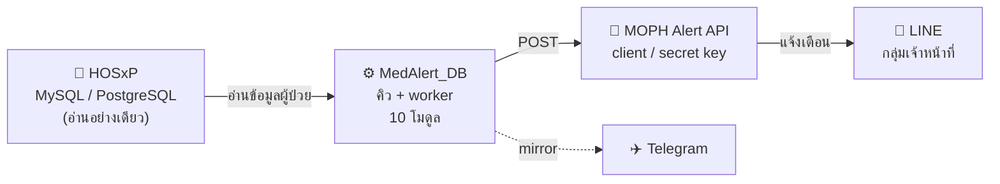
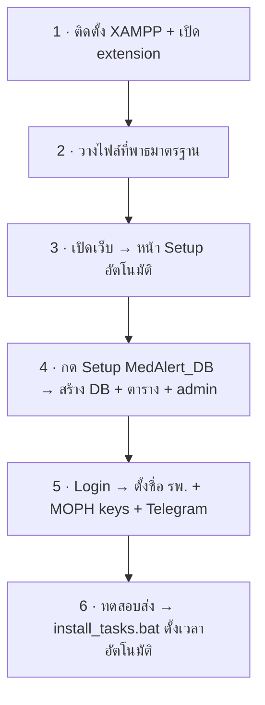

<div align="center">

# 🏥 MedAlert

### ระบบแจ้งเตือนผู้ป่วยกลุ่มเสี่ยง → **LINE &amp; Telegram** อัตโนมัติ

ดึงข้อมูลจาก HOSxP · ยิงแจ้งเตือนผ่าน MOPH Alert เข้ากลุ่มเจ้าหน้าที่ · ครบ **10 โมดูล** ในระบบเดียว

<br/>


**[📘 คู่มือติดตั้งฉบับภาพ (step-by-step)](docs/install-guide.html)** · [📄 INSTALL.md](INSTALL.md) · รพ.เชียงกลาง จ.น่าน

</div>

---

## 📋 สารบัญ

- [ระบบทำงานอย่างไร](#-ระบบทำงานอย่างไร)
- [10 โมดูลแจ้งเตือน](#-10-โมดูลแจ้งเตือน)
- [Quick Start (ติดตั้งใน 9 ขั้น)](#-quick-start)
- [การตั้งค่าหลัก](#-การตั้งค่าหลัก)
- [Dashboard](#-dashboard)
- [โครงสร้างโปรเจกต์](#-โครงสร้างโปรเจกต์)
- [Tech Stack](#-tech-stack)
- [แก้ปัญหาที่พบบ่อย](#-แก้ปัญหาที่พบบ่อย)

---

## 🔄 ระบบทำงานอย่างไร

**สองฐานข้อมูลแยกกันชัดเจน** — HOSxP เป็นแหล่งข้อมูลผู้ป่วย (แตะแบบ **อ่านอย่างเดียว** ปลอดภัยต่อ รพ.) ส่วน MedAlert_DB เป็นฐานข้อมูลของระบบเองสำหรับเก็บคิว/ผู้ใช้



> [!NOTE]
> ตั้งค่าการเชื่อมต่อทั้งสองฐานข้อมูลได้ในหน้า Setup หน้าเดียว (ตัวช่วยอัตโนมัติ) — ดู [Quick Start](#-quick-start)

---

## 🧩 10 โมดูลแจ้งเตือน

| โมดูล | งาน | ตารางคิว | หน้าใช้งาน |
|---|---|---|---|
| 🦴 หกล้ม/พลัดตก | Fall Risk | `fracture_queue` | `fracture_queue_ui.php` |
| 🧠 กลุ่มเสี่ยงจิตเวช | จิตเวช/ทำร้ายตัวเอง | `patient_queue` | `patient.php` |
| ⚠️ ยาอันตราย | High-Alert Drug | `drug_queue` | `drugitems01.php` |
| 🚑 อุบัติเหตุ พ.ร.บ. | Accident | `accident_queue` | `accident_queue_ui.php` |
| 💊 เภสัชกรรม / Lab | Lab วิกฤต | `pharm_lab_queue` | `pharm_lab_queue_ui.php` |
| 🦠 COVID-19 | ผลตรวจ Positive | `covid_queue` | `covid_queue_ui.php` |
| 🦟 ไข้เลือดออก | Dengue | `dengue_queue` | `dengue_queue_ui.php` |
| 🐀 เลปโตสไปโรซิส | Leptospirosis | `lepto_queue` | `Leptospira.php` |
| 🌿 สครับไทฟัส | Scrub Typhus | `scrub_queue` | `scrubtyphus.php` |
| 🚨 โรคติดต่อทางเพศ | STI / ความรุนแรง | `sexual_alert_queue` | `sexual.php` |

แต่ละโมดูลใช้ **MOPH client-key แยกกัน** (ผูกกับกลุ่ม LINE คนละกลุ่มได้) และ mirror เข้า Telegram ได้ทั้งหมด

---

## 🚀 Quick Start

> [!TIP]
> ขั้นตอนแบบละเอียด **พร้อมภาพประกอบ + mockup หน้าจอ** อยู่ที่ 👉 **[docs/install-guide.html](docs/install-guide.html)** (เปิดในเบราว์เซอร์)



**สรุปเป็นข้อ:**

1. **ติดตั้ง XAMPP 8.2** ที่ `C:\xampp` → Start Apache + MySQL → เปิด PHP extension ที่จำเป็น
   > 💡 ดับเบิลคลิก **`enable_php_extensions.bat`** เพื่อเปิด extension (`curl` `pdo_mysql` `mbstring` `pdo_pgsql` `pgsql`) + สำรอง php.ini + restart Apache ให้อัตโนมัติ — ไม่ต้องแก้ php.ini เอง
2. **วางไฟล์** ที่ `C:\xampp\htdocs\Fall_Risk_Alert-main` (พาธมาตรฐาน — สคริปต์ Task อ้างพาธนี้)
   ```bash
   cd C:\xampp\htdocs
   git clone https://github.com/nuttapong39/Fall_Risk_Alert-V.2.git Fall_Risk_Alert-main
   ```
3. **เปิด** `http://localhost/Fall_Risk_Alert-main/` → ระบบ **เด้งไปหน้า Setup อัตโนมัติ** (`db_config_admin.php`)
4. **กรอก HOSxP + MedAlert_DB + บัญชี admin** → กดปุ่ม **`Setup MedAlert_DB`** → ระบบ **สร้างฐานข้อมูล + ตารางทั้งหมด + บัญชีผู้ดูแลคนแรก** ให้อัตโนมัติ (ไม่ต้อง import SQL เอง)
5. **Login** → ตั้ง **ชื่อโรงพยาบาล** (`settings.php`) และ **MOPH keys + Telegram** (`moph_keys_admin.php`)
6. **ทดสอบส่ง** จากหน้าคิว → ยืนยันเข้ากลุ่ม LINE/Telegram → ดับเบิลคลิก **`task\install_tasks.bat`** เพื่อ **ติดตั้ง Scheduled Task ทั้ง 10 ในคลิกเดียว**

> [!WARNING]
> ต้องวางที่พาธ `C:\xampp\htdocs\Fall_Risk_Alert-main` เป๊ะ — `install_tasks.bat` และ `run_*.bat` อ้างพาธนี้แบบตายตัว

---

## ⚙️ การตั้งค่าหลัก

| หน้า | ทำอะไร |
|---|---|
| `db_config_admin.php` | ตั้งค่า **2 ฐานข้อมูล** (HOSxP source + MedAlert_DB) · ตัวช่วยสร้าง DB/ตาราง/admin อัตโนมัติ |
| `settings.php` | **ชื่อโรงพยาบาล** (ย่อ/เต็ม) · ธีม (Light/Dark/Pastel/Classic) · ขนาดฟอนต์ |
| `moph_keys_admin.php` | **MOPH client/secret key** รายโมดูล (ว่าง = ใช้ default) · **Telegram** bot token + chat_id + ปุ่มทดสอบ |
| `task\install_tasks.bat` | ติดตั้ง Scheduled Task ทั้ง 10 (self-elevate UAC) · ถอนด้วย `uninstall_tasks.bat` |

> [!NOTE]
> **Telegram:** ต้อง **ติ๊กเปิดใช้งาน + บันทึก** เคสจริงถึงจะ mirror (ปุ่มทดสอบส่งได้แม้ยังไม่เปิด) · Chat ID กลุ่มขึ้นต้นด้วย `-100…` (ไม่ใช่เลขหน้า `:` ใน bot token)

---

## 📊 Dashboard

`dashboard.php` — **ศูนย์รวมสถิติทุกโมดูลในหน้าเดียว**

- กราฟเทรนด์ 12 เดือน (Chart.js) แยกเส้นตามโมดูล + การ์ดสรุปราย 10 โมดูล
- เลือกช่วงเวลา: **รายเดือน / 3 / 6 / 9 เดือน / ไตรมาส (ปีงบ ต.ค.–ก.ย.)**
- Drill-in ราย module: Top station/PDX/Lab/ยา + ตาราง + **Export Excel (CSV)**

---

## 📁 โครงสร้างโปรเจกต์

```
Fall_Risk_Alert-main/
├─ config.php                 # โหลดค่ากลาง + ตรวจ first-run + เชื่อม DB
├─ db_config_admin.php        # ตัวช่วยตั้งค่า DB (สร้าง DB/ตาราง/admin)
├─ moph_keys_admin.php        # ตั้งค่า MOPH keys + Telegram
├─ moph_keys_loader.php       # โหลด keys → PHP constants
├─ site_config_loader.php     # โหลดชื่อโรงพยาบาล → HOSPITAL_SHORT/FULL
├─ settings.php               # ชื่อ รพ. / ธีม / ฟอนต์
├─ login.php  ·  index.php    # เข้าสู่ระบบ / หน้าหลัก
│
├─ dashboard.php              # ศูนย์รวม Dashboard ทุกโมดูล
├─ dashboard_modules.php      # registry กลาง (metadata ราย module)
├─ dashboard_export.php       # Export CSV ราย module/ช่วงเวลา
│
├─ *_queue_ui.php · patient.php · sexual.php … # หน้าคิว 10 โมดูล
├─ run_*.bat                  # worker ราย 10 โมดูล
├─ *_ingest.php · *_queue_action.php           # ดึง/ส่ง ราย module
│
├─ partials/{header,footer}.php   # Layout HR-CENTER 4.0 (sidebar/topbar/theme)
├─ flex_*.php                     # ตัวสร้าง LINE Flex Message (config-driven)
│
├─ task/                      # 🗓️ ตัวติดตั้ง Scheduled Task
│   ├─ install_tasks.bat  ·  uninstall_tasks.bat  ·  README.txt
│   └─ *.xml   (10 ไฟล์ export)
│
├─ docs/install-guide.html    # 📘 คู่มือติดตั้งฉบับภาพ
├─ secrets/                   # 🔒 .gitignore — สร้างเมื่อบันทึกผ่านหน้าเว็บ
│   ├─ db_config.json  ·  moph_keys.json  ·  site_config.json
│   └─ *.example.json         # template (อยู่ใน repo)
└─ logs/                      # สร้างอัตโนมัติเมื่อรัน
```

---

## 🛠️ Tech Stack

| ด้าน | เทคโนโลยี |
|---|---|
| Backend | PHP 8.2 (PDO, cURL) บน XAMPP/Apache |
| ฐานข้อมูล | MedAlert_DB = MySQL/MariaDB · HOSxP source = MySQL **หรือ** PostgreSQL |
| Frontend | Bootstrap 5 + Design System **HR-CENTER 4.0** · Chart.js · SweetAlert2 |
| แจ้งเตือน | MOPH Alert API (LINE Flex Message) + Telegram Bot API (mirror) |
| อัตโนมัติ | Windows Task Scheduler (รอบละ 5 นาที, รันเป็น SYSTEM) |

---

## 🩹 แก้ปัญหาที่พบบ่อย

| อาการ | วิธีแก้ |
|---|---|
| เข้าเว็บขึ้น **"DB connect failed"** | ตรวจ `secrets/db_config.json` ก้อน `medalert` · MySQL service Start อยู่ไหม |
| กด "ส่งซ้ำ" แล้ว **เคสค้าง Pending** | เช็คว่า **มี Scheduled Task ของโมดูลนั้นจริง** (`taskschd.msc`) — ปุ่ม Requeue แค่รีเซ็ตสถานะ |
| **Telegram** ทดสอบขึ้น แต่เคสจริงไม่เข้า | ยัง **ไม่ติ๊กเปิดใช้งาน + บันทึก** (ปุ่มทดสอบไม่เช็คสวิตช์นี้) |
| MOPH ตอบ **200 แต่ LINE ไม่เข้า** | key ผูกกลุ่มผิด / OA ยังไม่อยู่ในกลุ่ม · Flex มี `rgba()` (LINE รับเฉพาะ `#RRGGBB`) |
| PostgreSQL: **driver not found** | เปิด `extension=pdo_pgsql` + `pgsql` ใน php.ini → Restart Apache |
| Import แล้ว **ไม่พบผู้ป่วย** | ตรวจ `lab_items_code` ให้ตรง HOSxP · user MySQL มีสิทธิ์ SELECT ตาราง HOSxP |

ดู log ที่ `logs\` เสมอ — เช่น `logs\<module>_task_run.log` และ `logs\moph_alert_<module>.log`

---

## 📜 License

**MIT License** — ใช้งาน แก้ไข และแจกจ่ายได้อย่างอิสระ

พัฒนาโดย **รพ.เชียงกลาง จ.น่าน** · พบปัญหา/ขอความช่วยเหลือ เปิด Issue ที่ [GitHub Repository](https://github.com/nuttapong39/Fall_Risk_Alert-V.2)
