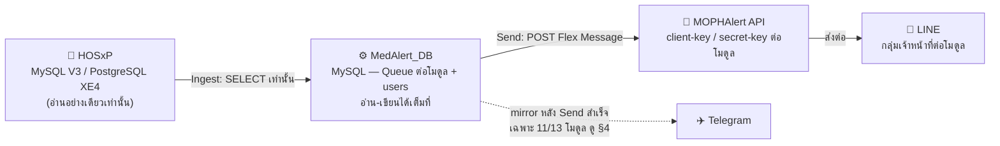

# Work-Flow ของระบบ MedAlert

> ไฟล์นี้ต้องอ่านก่อนเพิ่ม/แก้ไข feature, module หรือ workflow ใดๆ ในระบบเสมอ
> เพื่อไม่ให้กระทบสถาปัตยกรรมและกฎเหล็กที่มีอยู่

## 1. ภาพรวม Data Flow



12 Alert Module ทางคลินิก + 1 การแจ้งเตือนระบบ (`system_update` — ไม่ใช่ Alert Module
ตามนิยามใน CONTEXT.md) ดูตารางเต็มที่ [CONTEXT.md § Alert Modules](CONTEXT.md) และแผนที่
ไฟล์ต่อโมดูลที่ [docs/PROJECT-STRUCTURE.md](docs/PROJECT-STRUCTURE.md)

## 2. กฎเหล็กข้อที่ 1 — HOSxP ต้อง Read-Only เท่านั้น ห้ามเขียนเด็ดขาด

**ทุก query ต่อ HOSxP ต้องเป็น SELECT เท่านั้น ห้าม CREATE, INSERT, UPDATE, DELETE, ALTER,
DROP ไม่ว่ากรณีใดทั้งสิ้น** — นี่คือกฎที่พลาดไม่ได้ที่สุดของทั้งระบบ เพราะ HOSxP คือ
ฐานข้อมูลจริงของโรงพยาบาล ไม่ใช่ของระบบนี้

- เหตุผล/ประวัติการตัดสินใจ: ดู [ADR-0001](docs/adr/0001-split-readonly-hosxp-source-from-mysql-medalert-store.md)
- ทางเข้าถึง HOSxP มีทางเดียว: `hosxp_db()` ใน `config.php` — ไฟล์ที่อ่าน HOSxP ทั้งหมด
  อยู่ใน `sources/<mod>_source.php` เรียก `->query()`/`->prepare()` ด้วย SELECT ล้วน
  (ตรวจทุกไฟล์แล้ว ณ วันที่เขียนเอกสารนี้ — ไม่พบข้อยกเว้น)

> ⚠️ **Known gap — บังคับจริงแค่ครึ่งเดียว**: `hosxp_db()` บังคับ read-only ระดับ session
> จริงเฉพาะ dialect PostgreSQL (HOSxP XE4) ด้วย `SET SESSION CHARACTERISTICS AS
> TRANSACTION READ ONLY` — ส่วน dialect MySQL (HOSxP V3) **ไม่มีการบังคับระดับ session
> เลย** พึ่งวินัยของโค้ดล้วนๆ (`hosxp_db()` คืน PDO object เต็มรูปแบบ ไม่มีอะไรกัน
> โครงสร้างถ้ามีคนเผลอเขียน `->exec("INSERT...")`)
>
> **กฎเสริมจากช่องโหว่นี้**: ทุกครั้งที่แก้/เพิ่มโค้ดที่เรียก `hosxp_db()` ต้องตรวจด้วยตา
> เปล่าว่าเป็น SELECT เท่านั้น ห้ามพึ่ง driver ช่วยกัน เพราะ MySQL dialect ไม่ช่วยอะไรเลย

## 3. Pipeline มาตรฐานของ 1 Alert Module

ใช้ terminology ตาม [CONTEXT.md](CONTEXT.md) เป๊ะๆ: **Alert Module → Ingest → Queue →
Send → MOPHAlert**

```
Cron (Task Scheduler) → Worker.php → Ingest (Source Query → HOSxP, SELECT เท่านั้น)
  → เขียนลง Queue (MedAlert_DB, <mod>_queue) → Send (worker เดียวกัน หรือ *_queue_action.php)
  → POST ไป MOPHAlert (client-key/secret-key เฉพาะโมดูล) → LINE (ฝั่ง MOPH ส่งต่อเอง)
                                                           → Telegram mirror (แยก path, ดู §4)

Queue UI (<mod>_queue_ui.php) ให้ผู้ใช้ดู Pending/Sent และกด Resend/Requeue/ล้าง Error เอง
```

ตัวอย่างจริงครบวงจร 1 module (`had` — HAD Alert):

| ขั้นตอน | ไฟล์ |
|---|---|
| Ingest query จาก HOSxP | `sources/had_source.php` (`had_source_rows()`) |
| Worker (ingest+send รวมไฟล์เดียว) | `HAD.php` |
| Cron trigger | `run_had.bat` ← `task/HAD_Auto Sender.xml` (ทุก 5 นาที) |
| Queue table | `had_queue` (schema: `had_queue.sql`) |
| Queue UI | `had_queue_ui.php` |
| Action handler (resend/requeue/clear) | `had_queue_action.php` |
| Flex payload builder | `flex_builders.php` (`buildHadPayload()`) |

ทุกโมดูลตามรูปแบบเดียวกัน ต่างกันแค่ชื่อไฟล์ตาม module — ดูตารางเต็มที่
[docs/PROJECT-STRUCTURE.md](docs/PROJECT-STRUCTURE.md)

- **Queue เป็น MedAlert_DB เท่านั้น** — status column มาตรฐานทุก module: `status`
  (0=Pending, 1=Sent), `attempt`, `last_error`, `last_attempt_at`, `sent_at`, `out_ref`,
  `line_message_id`, `created_at`
- **Requeue ไม่ส่งเอง** — แค่ reset `status=0, attempt=0` กลับไปเป็น Pending รอ Cron
  worker รอบถัดไปมาส่งจริง → ถ้า module นั้นไม่มี scheduled task ใน `task/` ติดตั้งอยู่จริง
  Requeue จะค้าง Pending ตลอดไป (เช็ค Task Scheduler ก่อนสงสัยว่า Requeue พัง)
- **MOPH key ต้องอ้าง constant เฉพาะโมดูล** (`<MOD>_CLIENT_KEY`/`<MOD>_SECRET_KEY` จาก
  `moph_keys_loader.php`) ห้ามอ้าง `MOPH_CLIENT_KEY` ตรงๆ ในโค้ด module ใหม่ — ไม่งั้น key
  เฉพาะโมดูลที่ตั้งในหน้า `moph_keys_admin.php` จะไม่มีผล (เคยพลาดกับ covid มาแล้ว)
- **Module worker ต้อง `require config.php` ก่อน define constant ใดๆ เสมอ** — เคยพลาด
  (dengue เจอ 401 เพราะ define key ก่อน config.php โหลด)

## 4. Telegram Mirror — แยก path จาก MOPH, ไม่ครบทุก module

`telegram_mirror($module, $title, $row)` (`telegram_lib.php`) ถูกเรียกจากไฟล์
worker/ingest ของแต่ละโมดูลเอง **หลัง** ส่ง MOPH สำเร็จ — คนละ path จาก
`*_queue_action.php` (ปุ่ม resend ใน Queue UI **ไม่** mirror เข้า Telegram)

> ⚠️ **Known gap**: `had` และ `lab_hemato` (2 โมดูลล่าสุด) **ไม่เรียก `telegram_mirror()`
> เลย** — ต่างจากอีก 11 โมดูล ยังไม่ยืนยันว่าตั้งใจหรือหลุดตอนสร้าง ถ้าจะเพิ่ม mirror ให้
> 2 โมดูลนี้ ให้ทำตาม pattern เดียวกับ `covid_lib.php`/`dengue_ingest.php`

- ก่อนสงสัยว่า "ทำไม case จริงไม่ขึ้น Telegram": เช็ค `secrets/moph_keys.json` →
  `telegram.enabled` ต้องเป็น `true` ก่อน (ปุ่ม "ทดสอบส่ง" ในหน้า admin **ไม่เช็ค** flag นี้
  แต่ mirror จริงเช็ค) และอย่าสับสน `bot_id` กับ `chat_id`

## 5. Secrets & Credentials

- `secrets/*.json` (gitignored) เก็บ **token จริงของ production**: `moph_keys.json`
  (client/secret key ต่อโมดูล + Telegram bot token), `db_config.json` (DB credential จริง)
- **ห้ามทดสอบด้วยการยิง action ที่ส่ง Flex/LINE จริงเด็ดขาดโดยไม่ถามผู้ใช้ก่อน** — ต่อให้
  เป็นแค่ dev/debug ก็ห้าม เพราะ token เป็นของจริง กลุ่ม LINE จริงมีเจ้าหน้าที่จริงอยู่
- ถ้าจำเป็นต้องทดสอบเขียนไฟล์ secrets ใดๆ (เช่นหน้า `moph_keys_admin.php`) ต้องสำรองไฟล์
  จริงไว้นอก repo ก่อนเสมอ แล้ว diff/hash เทียบยืนยันว่าคืนค่าตรงเป๊ะหลังทดสอบเสร็จ

## 6. ระบบเวอร์ชัน — VERSION ต้อง bump ทุก commit ที่กระทบ รพ.

ทุก commit ที่มีผลกับสิ่งที่ deploy ไปแล้ว (โค้ด/schema/เอกสารที่ผู้ใช้เห็น) **ต้องอัปเดต
ไฟล์ `VERSION`** เป็นวันเวลาปัจจุบัน (`YYYY.MM.DD.HHMM`) พร้อมเพิ่มหัวข้อใน
`CHANGELOG.md` — ไม่งั้นปุ่ม "ตรวจสอบอัปเดต" ในระบบจะใช้งานไม่ได้

Windows quirks ของระบบอัปเดต (`task/update.bat`/`update.ps1`): `proc_open` บน Windows
ฆ่า detached child เสมอ ต้องใช้ wscript.exe+VBS แทน · `robocopy` ต้องระบุ `/R /W` เสมอ
ไม่งั้น retry ค้างเป็นล้านครั้ง · git checkout บางเครื่องทำ UTF-8 BOM ของ `.ps1` หาย →
ต้อง self-heal BOM ก่อนรันเสมอ

## 7. Known Gaps / Security Backlog

ยืนยันสถานะกับโค้ดจริงแล้ว ณ วันที่เขียนเอกสารนี้ — **เป็นของที่รู้อยู่แล้วและตั้งใจเลื่อน
แก้ ไม่ใช่บั๊กใหม่ที่ต้องรีบแก้เองทันทีโดยไม่ถามก่อน**:

1. **`cron_covid_queue.php` ไม่มี auth เลย** — เปิด URL เปล่าก็ยิง Flex จริงได้ ดึง HOSxP
   ได้ ไม่ต้อง login
2. **`*_action.php`/`*_queue_action.php` เกือบทุกโมดูลไม่มี auth** — `auth_guard` ถูก
   คอมเมนต์ปิดไว้ (ยกเว้น `module_filter_action.php`, `system_update_action.php` ที่เปิด
   อยู่) และบาง action (`import_hosxp`, `send_queue_item` ใน dengue/lepto/scrub) execute
   ก่อนถึงจุดเช็ค token ด้วยซ้ำ — ทำให้ยิง Flex จริง/ดึง HOSxP ได้แม้ไม่มี token
3. **`flex_preview.php` หลุด PHI คนไข้จริง** — `fracture_flex_preview.php`,
   `patient_flex_preview.php`, `pharm_flex_preview.php` ไม่มี auth เลย เดา `?id=` ก็เห็น
   HN/ชื่อ/ที่อยู่/เบอร์/การวินิจฉัยจริง (`patient` = โมดูลจิตเวช) — `had`/`lab_hemato`
   แก้แล้วใน commit `3ea3687`
4. **`server.php` ฝัง DB credential จริงในโค้ด** — `root`/`comsci`/`192.168.1.249` (ของจริง
   ไม่ผ่าน `secrets/`)
5. **`register.php` เปิดสมัครสมาชิกได้เอง ไม่มี invite/approve** — ใครก็เข้าไปสร้าง login
   ได้
6. **CSRF token เป็นค่า static ทั้งระบบ** — `UI_ACTION_TOKEN` = `'change-me-very-secret'`
   ตรงๆ ใน `config.php` ไม่ผูก session ส่วน token รายโมดูล (เช่น
   `ACCIDENT_UI_ACTION_TOKEN`) ก็แค่ hash คงที่ต่อวัน ไม่ผูก session เหมือนกัน

## 8. Checklist ก่อนเพิ่ม Alert Module ใหม่

1. เพิ่มแถวใน `moph_keys_admin.php`'s `$modules` array + [CONTEXT.md § Alert
   Modules](CONTEXT.md) + [docs/PROJECT-STRUCTURE.md](docs/PROJECT-STRUCTURE.md)
2. สร้างตาม naming convention: `sources/<mod>_source.php` (SELECT-only ต่อ HOSxP!) →
   `<mod>_queue.sql` → worker `.php` → `<mod>_queue_ui.php` → `<mod>_queue_action.php` →
   `flex_<mod>.php`
3. เพิ่ม default key/secret ใน `secrets/moph_keys.example.json` + mapping ใน
   `moph_keys_loader.php`
4. ตั้ง Task Scheduler จริง: เพิ่ม `.xml` ใน `task/` + ปุ่มใน `task/install_tasks.bat`
5. ถ้าต้องการ Telegram mirror: เรียก `telegram_mirror()` จาก worker หลัง MOPH ส่งสำเร็จ
   (ดู §4 — อย่าลืมแบบที่ `had`/`lab_hemato` ลืม)
6. ห้ามส่ง Flex/LINE จริงระหว่างทดสอบโดยไม่ถามก่อน (ดู §5)
7. bump `VERSION` + `CHANGELOG.md` ตอน commit (ดู §6)
